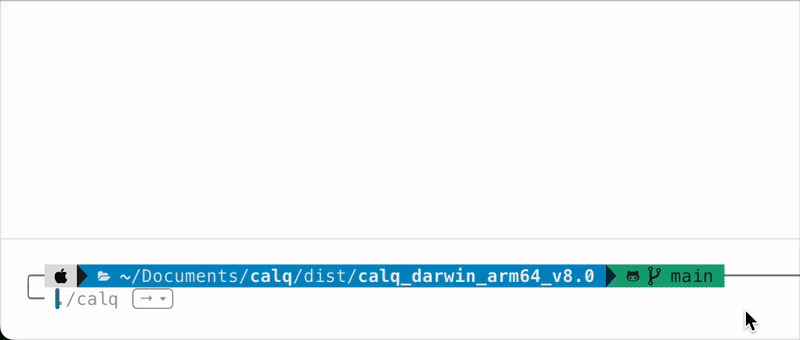

# calq

[](https://github.com/gabrieldeespindula/calq/releases)
[](https://codecov.io/gh/gabrieldeespindula/calq)

A simple terminal calculator written in Go.  
It evaluates basic mathematical expressions (addition, subtraction, multiplication, division) with operator precedence and supports using the last result in new expressions.

---

## Features

- Parses and evaluates simple math expressions
- Interactive terminal usage
- Operator precedence handling (`*` and `/` before `+` and `-`)
- Supports reusing the last result in new calculations

---

## Usage

### Prebuilt Executable (Release)

Download the latest release from the [Releases](https://github.com/gabrieldeespindula/calq/releases) page, extract it, and run:

```bash
./calq
```

Type your expressions and see the results.
Press `Ctrl+C` to exit.

---

### Development

To develop, build, or run the project locally using Docker and Makefile (no Go installation required):

1. Clone the repository:

```bash
git clone https://github.com/gabrieldeespindula/calq.git
cd calq
```

2. To run the project:

```bash
make run
```

These commands run Go inside a Docker container to provide a clean and reproducible environment.

---

### Running Tests Locally

To run tests and check code coverage locally, use:

```bash
make test
```
Run tests and generate coverage.out

```bash
make coverage
```
Run tests, generate and open coverage.html

---

## Project Structure

* `cmd/calq/main.go`: application entrypoint
* `internal/calculator/`: calculator logic (tokenization, evaluation, operations)
* `Dockerfile`: Docker image for development environment
* `docker-compose.yml`: Docker service config for development
* `Makefile`: shortcuts for building and running using Docker

---

## Technologies

* Go 1.22
* Docker (for isolated development environment)
* Makefile (command automation)

---

## Demo

This GIF shows how the `calq` CLI tool works in a terminal environment:



---

## Local Release (Snapshot)

You can generate a local (snapshot) release to test the artifacts built by GoReleaser without publishing them to GitHub. This helps validate the build process and binary structure before creating an actual release.

### Requirements

* Docker
* `docker-compose`

### Running Manually

```bash
make release-local
```

This will use the `goreleaser/goreleaser` container defined in `docker-compose.yml` to generate the binaries locally inside the `dist/` folder.

---

## Contributing

Contributions are welcome!
Please open issues for bugs or feature requests, and submit pull requests for review.

---

## License

MIT License © Gabriel de Espindula

---

## Contact

Gabriel de Espindula – [@gabrieldeespindula](https://github.com/gabrieldeespindula)

## About

This project was created as a personal learning exercise to deepen my understanding of Go, building from scratch a simple calculator with expression parsing and evaluation. While libraries exist that solve this problem more comprehensively, this project focuses on educational purposes.
